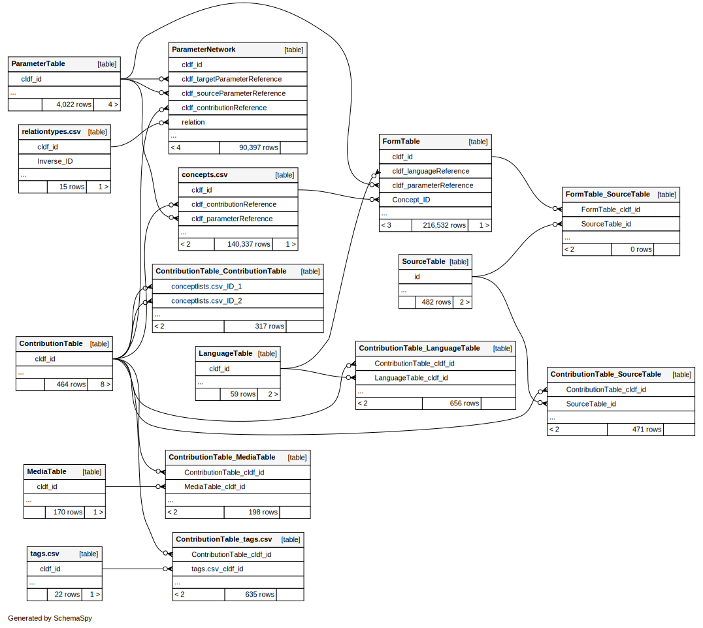

# Using Concepticon data from the CLDF dataset

[CLDF](https://cldf.clld.org) is a package format for linguistic data, bundling a set of tables as CSV files
with JSON metadata, describing - among other things - relations between these tables.

First, familiarize yourself with the data model by looking through [cldf/README.md](../cldf/README.md)
and the entity-relationship diagram below.




## It's all just text files!

The files in a CLDF dataset are just text files (even though the text may comply with higher-level formatting
rules like CSV or JSON). Thus, basic exploration of the data can easily be done with the tools available in the
[Unix Shell](https://swcarpentry.github.io/shell-novice/).

You can list the files in the dataset
```shell
$ ls -1 cldf
concepticon.csv
conceptlists.csv
concepts.csv
CONTRIBUTORS.md
glosses.csv
languages.csv
media.csv
parameter_network.csv
README.md
relationtypes.csv
requirements.txt
retired.csv
sources.bib
tags.csv
Wordlist-metadata.json
```

count rows in CSV tables
```shell
$ wc -l cldf/languages.csv 
60 cldf/languages.csv
```

and inspect the headers and data
```shell
$ head -n 2 cldf/languages.csv 
ID,Name,Macroarea,Latitude,Longitude,Glottocode,ISO639P3code
afrikaans,Afrikaans,,-22.0,30.0,,
```


## Most of these are tables, though!

While the standard Unix tools can get you a long way towards parsing tabular data formatted as CSV, tools like the
ones provided by [csvkit](https://csvkit.readthedocs.io/en/latest/) will make this a lot easier.

E.g. you could list all english glosses mapped to [FIRE](https://concepticon.clld.org/parameters/221) running
```shell
$ csvgrep -c Parameter_ID -r "^221$" cldf/glosses.csv | csvcut -c Language_ID,Form | sort | uniq -i | grep english
english,*fire
english,fire
english,fire 
english,fire*
english,fire-
english,Fire
english,"FIRE, (FIREWOOD)"
english,fire (for cooking)/heat
english,fire (n.)
english,the fire
```

Notes: 
- `csvgrep` allows you to "grep" in a CSV-aware way, i.e. considering only specified columns in a line.
- `csvcut` allows you to cut out relevant columns of a CSV file, thus creating output that is more more easily manipulated using
  standard shell tools.
- The gloss `FIRE, (FIREWOOD)` contains a comma, hence naively trying to split columns by splitting text lines at commas would have failed.


## Related tables, that is.

If we wanted to list concepts of a conceptlist with gloss and mapped Concepticon gloss, we'd have to join data from
two tables: [`glosses.csv`](../cldf/glosses.csv) and [`concepticon.csv`](../cldf/concepticon.csv) (and exploit the 
fact that gloss identifiers are based on the 
conceptlist identifiers):

```shell
$ csvjoin cldf/glosses.csv cldf/concepticon.csv -c Parameter_ID,ID | csvcut -c Form,Concept_ID,Name | csvgrep -c Concept_ID -m"Swadesh-1955-100"
Form,Concept_ID,Name
all,Swadesh-1955-100-1,ALL
bone,Swadesh-1955-100-10,BONE
yellow,Swadesh-1955-100-100,YELLOW
*breast,Swadesh-1955-100-11,BREAST
burn,Swadesh-1955-100-12,BURN
*claw,Swadesh-1955-100-13,CLAW
cloud,Swadesh-1955-100-14,CLOUD
...
```

Now, if we wanted to do this "properly", i.e. use only the conceptlist identifier `Swadesh-1955-100` as input, we'd
have to join data from [`concepts.csv`](../cldf/concepts.csv), too, which gets a bit cumbersome on the shell. But CLDF contains all the
information necessary to load a dataset into a relational database - and the [pycldf](https://github.com/cldf/pycldf)
package can turn any CLDF dataset into a [SQLite database](https://pycldf.readthedocs.io/en/latest/db.html), which can be queried
more comfortably using SQL.

```shell
$ cldf createdb cldf/Wordlist-metadata.json concepticon.sqlite
INFO    <cldf:v1.0:Wordlist at cldf> loaded in concepticon.sqlite
```

Now we can list the concepts of a conceptlist much like the web app does 
(e.g. at https://concepticon.clld.org/contributions/Swadesh-1955-100), running a query like
```sql
SELECT c.cldf_id, ft.cldf_form, pt.cldf_name FROM
  ContributionTable as ct,
  `concepts.csv` as c,
  FormTable as ft,
  ParameterTable as pt
WHERE
  ct.cldf_id = c.cldf_contributionReference AND
  ft.Concept_ID = c.cldf_id AND
  pt.cldf_id = ft.cldf_parameterReference AND
  ct.cldf_id = 'Swadesh-1955-100'
ORDER BY
  c.`Index`
```
via
```shell
$ sqlite3 concepticon.sqlite -header < query.sql
```
to get

cldf_id|cldf_form|cldf_name
--- | --- | ---
Swadesh-1955-100-1|all|ALL
Swadesh-1955-100-2|ashes|ASH
Swadesh-1955-100-3|bark|BARK
Swadesh-1955-100-4|belly|BELLY
Swadesh-1955-100-5|big|BIG
... | ... | ...

SQLite can also help with querying the graph of relations between conceptsets which are modeled as
edges, i.e. rows in the `ParameterNetwork` table. E.g. all conceptsets that are *narrower*
than `BROTHER` can be found using the following [recursive common table expression](https://www.sqlite.org/lang_with.html#recursivecte):
```sql
WITH RECURSIVE
  narrower(n) AS (
    SELECT cldf_id FROM ParameterTable WHERE cldf_name = 'BROTHER'
    UNION
    SELECT cldf_sourceParameterReference FROM ParameterNetwork, narrower
     WHERE ParameterNetwork.cldf_targetParameterReference=narrower.n AND ParameterNetwork.relation = 'broader'
  )
SELECT cldf_id, cldf_name FROM ParameterTable
 WHERE cldf_id IN narrower;
```

cldf_id|cldf_name
--- | ---
1262|BROTHER
1759|OLDER BROTHER
1760|YOUNGER BROTHER
2414|OLDER BROTHER (OF MAN)
2415|OLDER BROTHER (OF WOMAN)
2416|YOUNGER BROTHER (OF MAN)
2417|YOUNGER BROTHER (OF WOMAN)
559|BROTHER (OF MAN)
560|BROTHER (OF WOMAN)

We might also investigate conceptsets with a large number of concepts with english glosses differing
from the "default" Concepticon gloss using a query like
```sql
SELECT
    concepticon_id, concepticon_gloss, gloss, max(c) AS ngloss
FROM (
    SELECT
        p.cldf_id AS concepticon_id,
        p.cldf_name AS concepticon_gloss,
        c.cldf_name AS gloss,
        count(c.cldf_id) AS c
    FROM
        parametertable AS p,
        `concepts.csv` AS c,
        formtable AS f
    WHERE
        c.cldf_parameterreference = p.cldf_id AND
        f.concept_id = c.cldf_id AND
        f.cldf_languagereference = 'english'
    GROUP BY p.cldf_id, c.cldf_name
) AS q
WHERE
    lower(concepticon_gloss) != lower(gloss) AND
    cast(concepticon_id as int) != 0
GROUP BY concepticon_id
HAVING ngloss > 5
ORDER BY cast(concepticon_id AS int) LIMIT 5;
```

concepticon_id | concepticon_gloss | gloss | ngloss
---:| --- | --- | ---:
2|DUST|the dust|6
12|MIDDAY|noon|39
21|TASTE (SOMETHING)|taste|15
24|PRAY|to pray|7
38|SPREAD OUT|spread|7


## Dataset commands

`concepticon-cldf` makes use of [dataset specific sub-commands](https://github.com/cldf/cldfbench/blob/master/src/cldfbench/commands/README.md#dataset-specific-commands)
to be run with `cldfbench` to provide advanced functionality. To make these subcommands available, you need to
"install" the dataset as Python package, running
```shell
pip install -e .
```

### `cldfbench concepticon.intersection`

You can compute concepts shared between conceptlists with the `cldfbench concepticon.intersection` command.
A "classical" use case would be replicating the claim that

> [Comrie-1977-207](https://concepticon.clld.org/contributions/Comrie-1977-207) = [Swadesh-1952-200](https://concepticon.clld.org/contributions/Swadesh-1952-200) + [Swadesh-1955-100](https://concepticon.clld.org/contributions/Swadesh-1955-100)

First, we merge the two Swadesh lists:
```shell
$ cldfbench concepticon.intersection Swadesh-1955-100 Swadesh-1952-200 --maxdist 2 --output-union | \
  wc -l
207
```

Note that this took quite long (~20secs), because the implementation first loads the data into an 
[in-memory sqlite database](https://www.sqlite.org/inmemorydb.html).
If we specify the database we already created above, this will run a lot quicker:
```shell
f$ time cldfbench concepticon.intersection --db concepticon.sqlite Swadesh-1955-100 Swadesh-1952-200 --maxdist 2 --output-union | wc -l
207
real    0m1,512s
```

Then we pipe the merged Swadesh list as first list to a second `cldfbench concepticon.intersection` call (using the
`-` notation):
```shell
$ cldfbench concepticon.intersection Swadesh-1955-100 Swadesh-1952-200 --maxdist 2 --output-union | \
  cldfbench concepticon.intersection - Comrie-1977-207 --maxdist 3 --equate-instanceof --output-union --verbose | \
  wc -l
207
```

So the union of Swadesh-1955-100 and Swadesh-1952-200 yields 207 concepts, and merging these with the
concepts of Comrie-1977-207 yields (roughly) the same 207 concepts.

Note that for this to work out, we had to involve Concepticon's conceptset relations when comparing concepts
for equality, using the `--maxdist` and `--equate-instanceof` options.
(Run `cldfbench concepticon.intersection -h` for details.)
